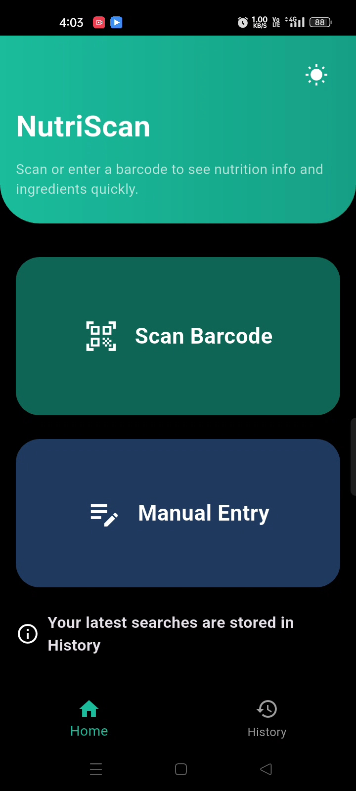
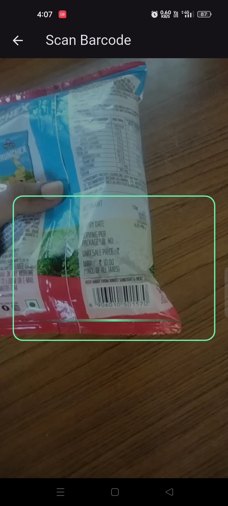
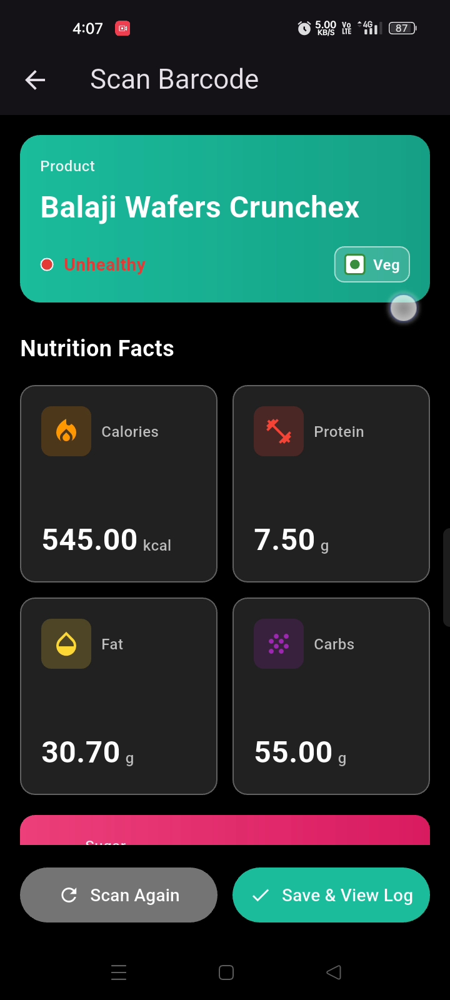
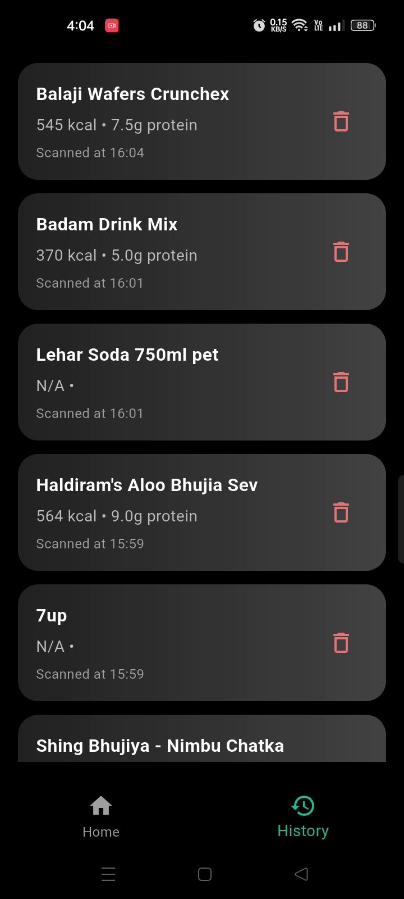

# 🥗 NutriScan - Smart Nutrition Analysis App

NutriScan is a Flutter-based mobile application that helps users make healthier food choices by scanning product barcodes and displaying detailed nutritional information in a simple and user-friendly interface.

The application is designed to provide instant access to nutritional values, ingredients, and product information, enabling users to make informed dietary decisions.

---

## 📱 Features

- 📷 Barcode scanning using the device camera
- 🔍 Instant product lookup
- 🥗 Displays detailed nutritional information
- 📊 Nutrition facts including calories, proteins, fats, carbohydrates, sugars, and more
- 📦 Product ingredient information
- 🔖 Session Based Search History 
- ⚡ Fast and intuitive user interface
- 📱 Cross-platform Flutter application
- 🖥️ Python backend integration

---

## 🛠️ Tech Stack

### Frontend
- Flutter
- Dart

### Backend
- Python
- Flask

### Development Tools
- Visual Studio Code
- Android Studio
- Git
- GitHub

---

## 📂 Project Structure

```
NutriScan-App/
│
├── backend/
│   ├── ...
│
├── frontend/
│   ├── lib/
│   ├── assets/
│   ├── android/
│   ├── ios/
│   └── ...
│
└── README.md
```

---

## 🚀 Getting Started

### Clone the Repository

```bash
git clone https://github.com/sujan05naik-afk/NutriScan-App.git
```

### Frontend

```bash
cd frontend
flutter pub get
flutter run
```

### Backend

```bash
cd backend
python app.py
```

---

## 📸 Screenshots

## 📸 Application Screenshots

### 🏠 Home Screen



The home screen provides users with a simple and intuitive interface to begin scanning food products and accessing nutritional information.

---

### 📷 Barcode Scanner



The built-in barcode scanner enables users to quickly identify packaged food products using their device's camera.

---

### 🥗 Nutrition Details



Displays comprehensive nutritional information, including calories, proteins, carbohydrates, fats, sugars, and ingredients.

---

### 🕒 Recent Searches



Allows users to quickly revisit previously scanned products for easy access to nutritional information.

---

## 🎯 Project Objective

The objective of NutriScan is to simplify nutrition awareness by allowing users to scan packaged food products and instantly access nutritional information. This promotes healthier eating habits and improves consumer awareness.

---

## 📈 Future Enhancements

- User authentication
- AI-powered health recommendations
- Offline product database
- Personalized dietary suggestions
- Multi-language support

---

## 👨‍💻 Developer

**Sujan Sainath Naik**

Bachelor of Computer Applications (BCA)

Passionate about Flutter Development, Python Programming, Mobile Application Development, and Software Engineering.

GitHub:
https://github.com/sujan05naik-afk


---

## 📄 License

This project is developed for educational and portfolio purposes.
